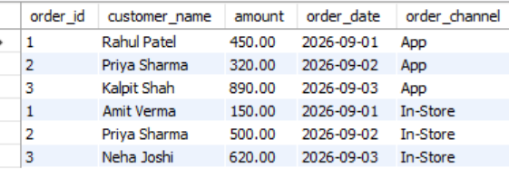
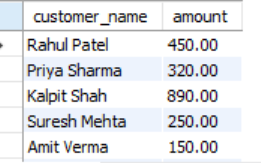

# SESSION 10 
 UNION & UNION ALLTopics:Combine multiple tablesDifference between UNION vs UNION ALLCompatible column structuresDemo:Combine online + offline sales tables.
 1.
Create two tables: AppOrders (for orders placed via a food delivery app like Zomato) and InStoreOrders (for direct restaurant orders), each with columns: order_id, customer_name, amount, and order_date. Insert at least 3 sample records into each table.
<b>Ans.</b>
-- 1. Create AppOrders Table
CREATE TABLE AppOrders (
    order_id INT PRIMARY KEY AUTO_INCREMENT,
    customer_name VARCHAR(50),
    amount DECIMAL(10, 2),
    order_date DATE
);

-- 2. Create InStoreOrders Table
CREATE TABLE InStoreOrders (
    order_id INT PRIMARY KEY AUTO_INCREMENT,
    customer_name VARCHAR(50),
    amount DECIMAL(10, 2),
    order_date DATE
);

-- 3. Insert Sample Data
INSERT INTO AppOrders (customer_name, amount, order_date) VALUES
('Rahul Patel', 450.00, '2026-09-01'),
('Priya Sharma', 320.00, '2026-09-02'),
('Kalpit Shah', 890.00, '2026-09-03');

INSERT INTO InStoreOrders (customer_name, amount, order_date) VALUES
('Amit Verma', 150.00, '2026-09-01'),
('Priya Sharma', 500.00, '2026-09-02'), -- Duplicate customer name across channels
('Neha Joshi', 620.00, '2026-09-03');
<b>Output:</b>
 Table created
 2.
Write a SQL query using UNION to combine all unique customer names from both AppOrders and InStoreOrders tables into a single list.
<b>Ans.</b>
-- Returns only unique customer names from both sales channels
SELECT customer_name FROM AppOrders
UNION
SELECT customer_name FROM InStoreOrders;
<b>Output:</b>
 
 3.
Write a SQL query using UNION ALL to display every order (including duplicates if any) from both AppOrders and InStoreOrders, showing order_id, customer_name, amount, and order_date.
<b>Ans.</b>
-- Combines all orders, retaining all records and preserving channel origins
SELECT order_id, customer_name, amount, order_date, 'App' AS order_channel 
FROM AppOrders

UNION ALL

SELECT order_id, customer_name, amount, order_date, 'In-Store' AS order_channel 
FROM InStoreOrders;
<b>Output:</b>
 
 4.
Demonstrate the difference between UNION and UNION ALL by adding a duplicate customer_name in both tables, then running both queries and noting the difference in the result count.
<b>Ans.</b>
SELECT customer_name, amount FROM AppOrders
UNION
SELECT customer_name, amount FROM InStoreOrders;

SELECT customer_name, amount FROM AppOrders
UNION ALL
SELECT customer_name, amount FROM InStoreOrders;
<b>Output:</b>
 
 