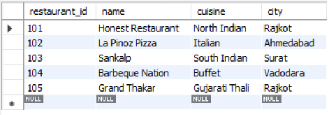
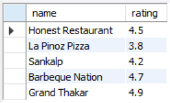
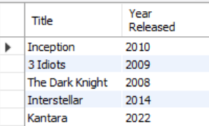
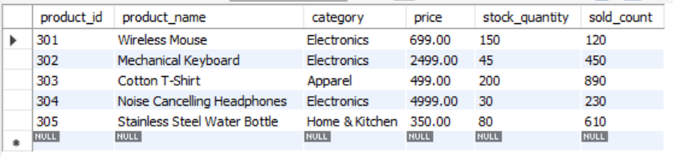

# SESSION 2 

 Basic SELECT & FROMTopics:SELECT column1, column2SELECT *Renaming columns (AS keyword)Comments in SQLDemo:SELECT * FROM employees;

 The `SELECT` statement is the foundation of data retrieval in SQL. It specifies which columns to pull from a dataset, while the `FROM` clause defines the target table.

### Core Syntax & Concepts

* **SELECT * (Select All):** Retrieves every column in the table. Useful for quick inspection, though explicitly listing columns is preferred in production for performance.
* **Selecting Specific Columns:** Isolates only the fields required, reducing memory usage and query execution time.
* **Column Aliasing (`AS`):** Renames output columns temporarily for readability or to fit presentation standards.
* **SQL Comments:** Single-line (`--`) or multi-line (`/* ... */`) annotations ignored by the query engine, used to document business logic.

### Quick Syntax Summary

| Syntax Element | Description | Example |
| --- | --- | --- |
| `SELECT *` | Fetches all table columns | `SELECT * FROM employees;` |
| `SELECT col1, col2` | Fetches targeted columns | `SELECT first_name, salary FROM employees;` |
| `AS alias_name` | Renames column header in output | `SELECT salary AS "Current Salary"` |
| `-- comment` | Single-line comment | `-- Query to pull staff roster` |

1.Open your SQL editor and run a query to select all columns from a table named restaurants using SELECT * FROM restaurants;.

<b>Ans.</b>
 SELECT * FROM restaurants;

<b>Output:</b>
 

2.Write an SQL query to display only the name and rating columns from the table zomato_reviews.

<b>Ans.</b>
 SELECT name, rating FROM zomato_reviews;

<b>Output:</b>
 

3.Write an SQL query to select the movie_name and release_year columns from a table called movies, but rename movie_name as 'Title' and release_year as 'Year Released' in the output using the AS keyword.

<b>Ans.</b>
 SELECT movie_name AS "Title", release_year AS "Year Released" FROM movies;

<b>Output:</b>
 

4.In a table called products, write an SQL query that selects all columns and add a comment in your SQL code explaining what the query does.  <em><strong>Hint:</strong> Use -- to write a single-line comment above your query.</em>

<b>Ans.</b>
 -- Select all products and their details from the database
 SELECT * FROM products;

<b>Output:</b>
 