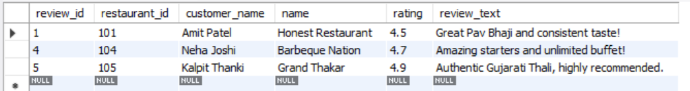
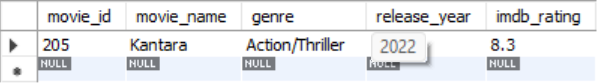
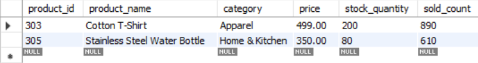
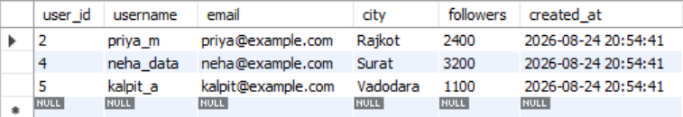

# SESSION 3 
 
 WHERE Clause & OperatorsTopics:WHERE=, <>, >, <, <=, >=Logical operators AND, OR, NOTDemo:Filter employees with salary > 50000 and in "IT" dept.

1.Write an SQL query to select all restaurants from a table named 'restaurants' where the rating is greater than or equal to 4.5.

<b>Ans.</b>
 SELECT * FROM restaurants WHERE rating  >= 4.5;

<b>Output:</b>
 

2.In a table called 'movies', filter and display only the movies released after 2020 and with genre 'Action' using the WHERE clause and AND operator.

<b>Ans.</b>
 
SELECT * FROM movies WHERE release_year > 2020 AND genre = 'Action/Thriller';

<b>Output:</b>
 

3.Given a table 'products' with columns (id, name, price, category), write a query to find all products not in the 'Electronics' category or with a price less than 500.

<b>Ans.</b>
 SELECT * FROM products WHERE category != 'Electronics' OR price < 500;

<b>Output:</b>
 

4.Write an SQL query for a table 'users' to show all users who are NOT from 'Ahmedabad' and have more than 1000 followers.  <em><strong>Hint:</strong> Use the NOT operator combined with AND.</em>

<b>Ans.</b>
 SELECT * FROM users WHERE NOT city = 'Ahmedabad' AND followers > 1000;

<b>Output:</b>
 