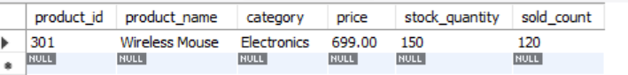
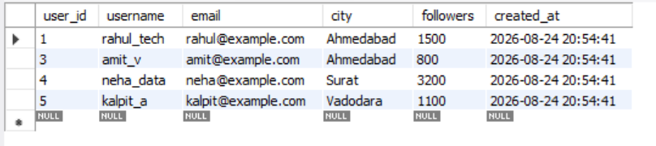
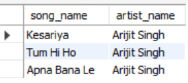

# SESSION 4 
  Wildcards & Pattern Matching (LIKE, BETWEEN, IN)Topics:LIKE (“R%”)BETWEEN (ranges)IN (multiple values)Demo:Find all customers whose names start with ‘M’.

1.Write an SQL query to find all restaurants in a table called Restaurants whose names end with 'Cafe' using the LIKE operator.

<b>Ans.</b>
 SELECT * FROM Zomato_reviews WHERE name LIKE '%Cafe';

<b>Output:</b>
 

2.In a Flipkart-style Products table, use the BETWEEN operator to select all products with a price between 500 and 1500 rupees.

<b>Ans.</b>
 SELECT * FROM Products WHERE price BETWEEN 500 AND 1500;

<b>Output:</b>
 

3.Write an SQL query to display all users from a Users table whose city is either 'Ahmedabad', 'Surat', or 'Vadodara' using the IN operator.

<b>Ans.</b>
 SELECT * FROM Users WHERE city IN ('Ahmedabad', 'Surat', 'Vadodara');

<b>Output:</b>
 

4.Given a table called Songs with columns song_name and artist_name, find all songs where the artist_name contains the letter sequence 'ar' anywhere in the name using the LIKE operator.  <em><strong>Hint:</strong> Use wildcards on both sides of the pattern.</em>

<b>Ans.</b>
 SELECT song_name, artist_name FROM Songs WHERE artist_name LIKE '%ar%';

<b>Output:</b>
 