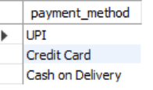
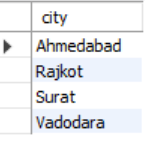
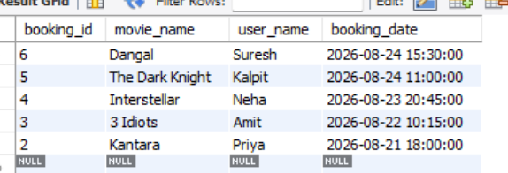
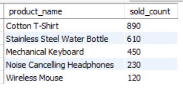

# SESSION 5 
 DISTINCT, ORDER BY, LIMITTopics:DISTINCTSorting (ASC, DESC)Limiting rowsDemo:Top 10 highest selling products.

1.Write an SQL query using the DISTINCT keyword to find all unique payment methods used in the orders table of a food delivery app database.

<b>Ans.</b>
 SELECT DISTINCT payment_method FROM orders;

<b>Output:</b>
 

2.Query the users table to list all cities where users have registered, but display each city only once and sort the result in alphabetical order (A-Z).

<b>Ans.</b>
 SELECT DISTINCT city FROM users ORDER BY city ASC;

<b>Output:</b>
 

3.Write an SQL query to select the top 5 most recent movie bookings from the bookings table, ordered by booking_date in descending order.

<b>Ans.</b>
 SELECT * FROM bookings ORDER BY booking_date DESC LIMIT 5;

<b>Output:</b>
 

4.From a products table containing Flipkart-style product data (id, name, category, sold_count), write an SQL query to retrieve the 10 products with the highest sold_count, displaying only product name and sold_count, sorted from highest to lowest.  <em><strong>Hint:</strong> Use ORDER BY and LIMIT together to achieve this.</em>

<b>Ans.</b>
 SELECT product_name, sold_count FROM products ORDER BY sold_count DESC LIMIT 10;

<b>Output:</b>
 