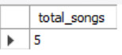
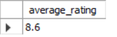
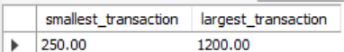
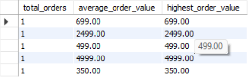

# SESSION 6

Aggregate FunctionsTopics:SUM(), COUNT(), AVG(), MIN(), MAX()Rounding numbers (ROUND).

1.
Write an SQL query using the SUM() function to calculate the total amount spent by users on food orders in a table food_orders (columns: order_id, user_id, amount).

<b>Ans.</b>
SELECT SUM(amount) AS total_spent 
FROM orders;

<b>Output:</b>

2.
Using the COUNT() function, find out how many songs a user has added to their playlist in a table spotify_playlists (columns: playlist_id, user_id, song_id).

<b>Ans.</b>
SELECT COUNT(song_id) AS total_songs 
FROM songs;

<b>Output:</b>

3.
Write an SQL query to get the average rating given to a movie in a table bookmyshow_reviews (columns: review_id, movie_id, rating), and round the result to 1 decimal place using the ROUND() function.

<b>Ans.</b>
SELECT ROUND(AVG(imdb_rating), 1) AS average_rating 
FROM movies;

<b>Output:</b>

4.
Find the minimum and maximum transaction values for a user from a table paytm_transactions (columns: txn_id, user_id, amount) — show both the smallest and largest transaction amounts.

<b>Ans.</b>
SELECT MIN(amount) AS smallest_transaction,MAX(amount) AS largest_transaction 
FROM orders;

<b>Output:</b>

5.
Given a table myntra_orders (columns: order_id, user_id, total_price), write an SQL query to display the total number of orders, the average order value (rounded to 2 decimals), and the highest order value for each user_id.

<b>Ans.</b>
SELECT 
    COUNT(product_id) AS total_orders, 
    ROUND(AVG(price), 2) AS average_order_value, 
    MAX(price) AS highest_order_value 
FROM products 
GROUP BY product_id;
<b>Output:</b>

