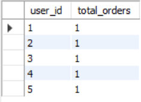
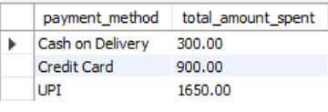
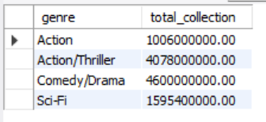

# SESSION 7 
GROUP BY & HAVING (Critical Analytics Topic)Topics:GROUP BY basicsHAVING vs WHERE Aggregation filters.

1.
Write an SQL query to display the total number of orders placed by each user in a 'food_orders' table, grouped by user_id.
<b>Ans.</b>
 SELECT user_id, COUNT(order_id) AS total_orders FROM orders GROUP BY user_id;

<b>Output:</b>
 

2.
Using a 'transactions' table with columns (transaction_id, user_id, amount, payment_method), write an SQL query to show the total amount spent by each payment_method.
<b>Ans.</b>
SELECT payment_method, SUM(amount) AS total_amount_spent FROM orders GROUP BY payment_method;

<b>Output:</b>
 

3.
Given a 'movies' table with columns (movie_id, genre, box_office_collection), write an SQL query to display each genre and its total box_office_collection, but only show genres where the total collection is above 10 crore.
<b>Ans.</b>
SELECT genre, SUM(box_office_collection) AS total_collection FROM movies
GROUP BY genre HAVING SUM(box_office_collection) > 100000000;

<b>Output:</b>
 

4.
Suppose you have a 'playlist' table with columns (playlist_id, user_id, song_id, duration). Write an SQL query to find users who have created playlists with a combined song duration of more than 2 hours (7200 seconds), showing user_id and total duration.
<b>Ans.</b>
SELECT 
    song_id, 
    SUM(duration) AS total_duration_seconds FROM songs GROUP BY song_id HAVING SUM(duration) > 7200;
