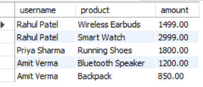
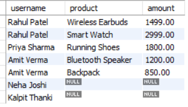
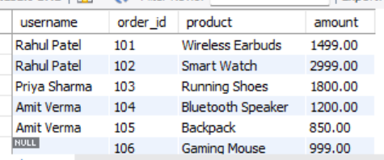

# SESSION 8
JOINS: INNER, LEFT, RIGHT (Foundation Session)Topics:Relationship between tablesPrimary / Foreign KeysINNER JOINLEFT JOINRIGHT JOIN.

1.
Create two tables in your SQL database: Users (user_id, username, city) and Orders (order_id, user_id, product, amount). Insert at least 3 users and 5 orders, making sure some users have no orders.

<b>Ans.</b>
-- 1. Create Users Table
CREATE TABLE Users (
    user_id INT PRIMARY KEY AUTO_INCREMENT,
    username VARCHAR(50) NOT NULL,
    city VARCHAR(50)
);

-- 2. Create Orders Table with Foreign Key
CREATE TABLE Orders (
    order_id INT PRIMARY KEY AUTO_INCREMENT,
    user_id INT,
    product VARCHAR(100),
    amount DECIMAL(10, 2),
    FOREIGN KEY (user_id) REFERENCES Users(user_id) ON DELETE SET NULL
);

-- 3. Insert Users (5 users total)
INSERT INTO Users (user_id, username, city) VALUES
(1, 'Rahul Patel', 'Ahmedabad'),
(2, 'Priya Sharma', 'Rajkot'),
(3, 'Amit Verma', 'Surat'),
(4, 'Neha Joshi', 'Vadodara'),   -- User with no orders
(5, 'Kalpit Thanki', 'Porbandar');   -- User with no orders

-- 4. Insert Orders
INSERT INTO Orders (order_id, user_id, product, amount) VALUES
(101, 1, 'Wireless Earbuds', 1499.00),
(102, 1, 'Smart Watch', 2999.00),
(103, 2, 'Running Shoes', 1800.00),
(104, 3, 'Bluetooth Speaker', 1200.00),
(105, 3, 'Backpack', 850.00);

<b>Output:</b>
Table Created

2.
Write an SQL query using INNER JOIN to list all usernames and their ordered products, showing only users who have placed at least one order.
<b>Ans.</b>
SELECT 
    Users.username, 
    Orders.product, 
    Orders.amount
FROM Users
INNER JOIN Orders ON Users.user_id = Orders.user_id;

<b>Output:</b>
 

3.
Write an SQL query using LEFT JOIN to display all usernames along with their ordered products. For users who haven't placed any orders, show NULL for the product.
<b>Ans.</b>
SELECT Users.username, Orders.product, Orders.amount
FROM Users
LEFT JOIN Orders ON Users.user_id = Orders.user_id;

<b>Output:</b>
 

4.
Write an SQL query using RIGHT JOIN to show all orders and the corresponding username for each order. If an order has a user_id that doesn't exist in the Users table, display NULL for the username.  <em><strong>Hint:</strong> Try deleting one user and keeping their order to test this case.</em>
<b>Ans.</b>
-- Insert an orphan order with no associated user
INSERT INTO Orders (order_id, user_id, product, amount) 
VALUES (106, NULL, 'Gaming Mouse', 999.00);

-- Execute RIGHT JOIN query
SELECT 
    Users.username, Orders.order_id, Orders.product, Orders.amount
FROM Users
RIGHT JOIN Orders ON Users.user_id = Orders.user_id;

<b>Output:</b>
 

5.
Suppose you want to analyze food delivery data like Zomato. Create a CustomerSegments table (segment_id, segment_name), and link it to Users with a foreign key. Write an SQL query to show each username, their segment name, and total order amount (use JOINs as needed).
<b>Ans.</b>
-- 1. Create CustomerSegments Table
CREATE TABLE CustomerSegments (
    segment_id INT PRIMARY KEY AUTO_INCREMENT,
    segment_name VARCHAR(50)
);

INSERT INTO CustomerSegments (segment_id, segment_name) VALUES
(1, 'VIP / High Value'),
(2, 'Regular'),
(3, 'Occasional');

-- 2. Add segment_id Foreign Key to Users Table
ALTER TABLE Users ADD COLUMN segment_id INT;
ALTER TABLE Users ADD CONSTRAINT fk_segment FOREIGN KEY (segment_id) REFERENCES CustomerSegments(segment_id);

-- Assign segments to users
UPDATE Users SET segment_id = 1 WHERE user_id IN (1, 3);
UPDATE Users SET segment_id = 2 WHERE user_id = 2;
UPDATE Users SET segment_id = 3 WHERE user_id IN (4, 5);

-- 3. Query User, Segment Name, and Total Order Amount
SELECT 
    u.username,
    cs.segment_name,
    COALESCE(SUM(o.amount), 0.00) AS total_order_amount
FROM Users u
LEFT JOIN CustomerSegments cs ON u.segment_id = cs.segment_id
LEFT JOIN Orders o ON u.user_id = o.user_id
GROUP BY u.user_id, u.username, cs.segment_name;
