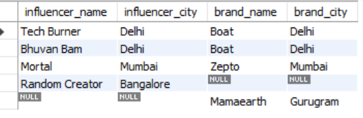
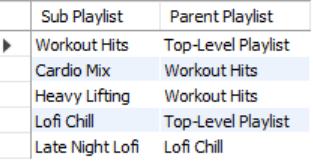
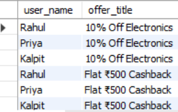
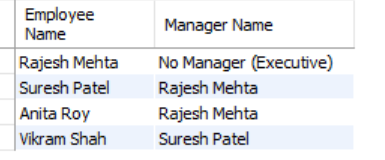

# SESSION 9
ADVANCED JOINS: FULL OUTER, SELF JOIN, CROSS JOINTopics:FULL OUTERSELF JOINCROSS JOIN (Cartesian)When to use eachDemo:Self join employees table ? manager relationship.
 1.
Create two tables, influencers and brands, with at least 3 sample rows each. Use a FULL OUTER JOIN to list all influencers and brands, showing influencer_name and brand_name, matching on city. If there is no match, display NULL for the missing side.
 <b>Ans.</b>
 
-- 1. Create and populate tables
CREATE TABLE influencers (
    influencer_id INT PRIMARY KEY AUTO_INCREMENT,
    influencer_name VARCHAR(50),
    city VARCHAR(50)
);

CREATE TABLE brands (
    brand_id INT PRIMARY KEY AUTO_INCREMENT,
    brand_name VARCHAR(50),
    city VARCHAR(50)
);

INSERT INTO influencers (influencer_name, city) VALUES
('Tech Burner', 'Delhi'),
('Mortal', 'Mumbai'),
('Bhuvan Bam', 'Delhi'),
('Random Creator', 'Bangalore');

INSERT INTO brands (brand_name, city) VALUES
('Boat', 'Delhi'),
('Mamaearth', 'Gurugram'),
('Zepto', 'Mumbai');

-- 2. Emulate FULL OUTER JOIN using LEFT JOIN, RIGHT JOIN, and UNION
SELECT i.influencer_name, i.city AS influencer_city, b.brand_name, b.city AS brand_city
FROM influencers i
LEFT JOIN brands b ON i.city = b.city

UNION

SELECT i.influencer_name, i.city AS influencer_city, b.brand_name, b.city AS brand_city
FROM influencers i
RIGHT JOIN brands b ON i.city = b.city;
<b>Output:</b>
 

2.
Given a table called playlists with columns (id, playlist_name, parent_playlist_id), write a SELF JOIN query to display each playlist alongside its parent playlist's name, similar to how Spotify might nest playlists.
<b>Ans.</b>
-- 1. Create and populate playlists table
CREATE TABLE playlists (
    id INT PRIMARY KEY AUTO_INCREMENT,
    playlist_name VARCHAR(50),
    parent_playlist_id INT
);

INSERT INTO playlists (id, playlist_name, parent_playlist_id) VALUES
(1, 'Workout Hits', NULL),        -- Root playlist
(2, 'Cardio Mix', 1),             -- Child of Workout Hits
(3, 'Heavy Lifting', 1),          -- Child of Workout Hits
(4, 'Lofi Chill', NULL),          -- Root playlist
(5, 'Late Night Lofi', 4);        -- Child of Lofi Chill

-- 2. SELF JOIN query to display nested hierarchy
SELECT 
    child.playlist_name AS "Sub Playlist",
    COALESCE(parent.playlist_name, 'Top-Level Playlist') AS "Parent Playlist"
FROM playlists child
LEFT JOIN playlists parent ON child.parent_playlist_id = parent.id;

<b>Output:</b>
 
3.
Create two tables: users and offers. Write a CROSS JOIN query to generate all possible combinations of users and offers, displaying user_name and offer_title. Explain in a comment how this could be used for a Flipkart-style personalized offer campaign.
<b>Ans.</b>
-- 1. Create and populate tables
CREATE TABLE users_offers (
    user_id INT PRIMARY KEY AUTO_INCREMENT,
    user_name VARCHAR(50)
);

CREATE TABLE offers (
    offer_id INT PRIMARY KEY AUTO_INCREMENT,
    offer_title VARCHAR(100)
);

INSERT INTO users_offers (user_name) VALUES ('Rahul'), ('Priya'), ('Kalpit');
INSERT INTO offers (offer_title) VALUES ('10% Off Electronics'), ('Flat ₹500 Cashback'), ('Free Shipping');

-- 2. CROSS JOIN Query with analytical commentary
-- Use case: Generating default banner assignment records or batch testing offer recommendations across all users.
SELECT 
    u.user_name,
    o.offer_title
FROM users_offers u
CROSS JOIN offers o;
<b>Output:</b>
 

4.
You have an employees table with columns (id, name, manager_id). Write a SELF JOIN to display each employee's name along with their manager's name. Then, modify your query to only show employees who do not have a manager (i.e., top-level managers).
 <b>Ans.</b>
-- 1. Create and populate employees table
CREATE TABLE employees (
    id INT PRIMARY KEY AUTO_INCREMENT,
    name VARCHAR(50),
    manager_id INT
);

INSERT INTO employees (id, name, manager_id) VALUES
(1, 'Rajesh Mehta', NULL),   -- CEO / Top Manager
(2, 'Suresh Patel', 1),      -- Reports to Rajesh
(3, 'Anita Roy', 1),         -- Reports to Rajesh
(4, 'Vikram Shah', 2);       -- Reports to Suresh

-- 2A. List all employees along with their manager's name
SELECT 
    e.name AS "Employee Name",
    COALESCE(m.name, 'No Manager (Executive)') AS "Manager Name"
FROM employees e
LEFT JOIN employees m ON e.manager_id = m.id;

-- 2B. Filter to display ONLY top-level managers (no manager assigned)
SELECT 
    e.id,
    e.name AS "Top Level Manager"
FROM employees e
WHERE e.manager_id IS NULL;
 <b>Output:</b>
 
 

5.
Use ChatGPT or Copilot to help you write a SQL query that finds all pairs of users from a users table who live in the same city (excluding pairs where the user is compared with themselves). Paste the query and briefly describe how the AI helped you improve or debug it.
<b>Ans.</b>
-- Find distinct user pairs who live in the same city (excluding self-matches and duplicate reverse pairs)
SELECT 
    u1.user_name AS "User 1",
    u2.user_name AS "User 2",
    u1.city
FROM Users u1
INNER JOIN Users u2 ON u1.city = u2.city 
                   AND u1.user_id < u2.user_id;